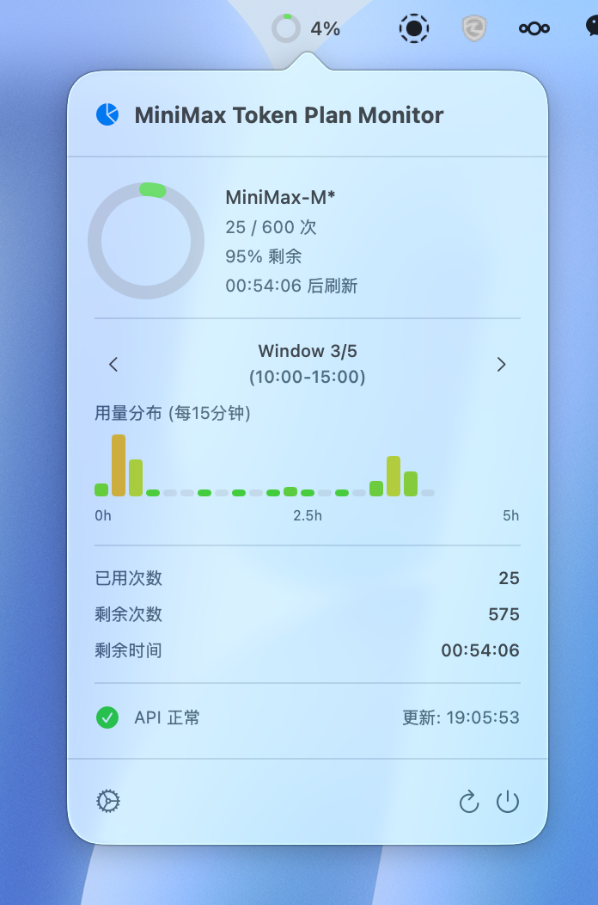

# MiniMax Token Monitor

macOS 菜单栏应用，用于监控 MiniMax API Token 使用情况。

## 功能特性

- **菜单栏常驻** - 状态栏显示当前 Token 使用百分比
- **实时数据** - 每 5 秒自动刷新 API 使用数据
- **用量环图** - 环形进度图直观展示已用量
- **时段柱状图** - 分 5 个时段（00:00-24:00）展示每小时用量分布
- **Keychain 安全存储** - API Key 安全存储在 macOS Keychain 中
- **支持多模型** - 监控 `MiniMax-M*` 系列模型的用量

## 截图预览



点击菜单栏图标显示详情弹窗，包含：
- Token 剩余百分比环形图
- 当日用量柱状图（按时段划分）
- 已用/剩余次数及剩余时间
- API 连接状态

## 环境要求

- macOS 13.0 (Ventura) 及以上
- Xcode 15.0+

## 构建与运行

```bash
# 生成 Xcode 项目
cd MiniMaxTokenMonitor
xcodegen generate

# 使用 Xcode 打开并运行
open MiniMaxTokenMonitor.xcodeproj
```

或在 Xcode 中直接选择 Product > Run。

## 配置

首次运行时会提示设置 API Key。点击设置图标，输入你的 MiniMax API Key 后保存。API Key 将存储在系统 Keychain 中。

## 项目结构

```
Sources/
├── App/
│   ├── main.swift          # 应用入口
│   └── AppDelegate.swift   # 应用代理，管理状态栏和弹窗
├── Models/
│   ├── UsageResponse.swift    # API 响应模型
│   ├── UsageSample.swift      # 用量采样数据
│   └── DailyUsageData.swift   # 日用量数据结构
├── Services/
│   ├── MiniMaxAPIService.swift    # MiniMax API 调用
│   ├── UsageHistoryService.swift  # 用量历史管理
│   └── StorageManager.swift       # 磁盘存储管理
└── Views/
    ├── TokenRingView.swift     # 环形进度图
    ├── UsageBarChartView.swift # 柱状图
    ├── UsageWindowView.swift   # 时段选择视图
    ├── PopoverContentView.swift # 弹窗主视图
    └── SettingsView.swift      # 设置视图
```

## 技术栈

- **Swift 5.9**
- **SwiftUI** - UI 框架
- **AppKit** - 菜单栏集成
- **Security.framework** - Keychain 存储
